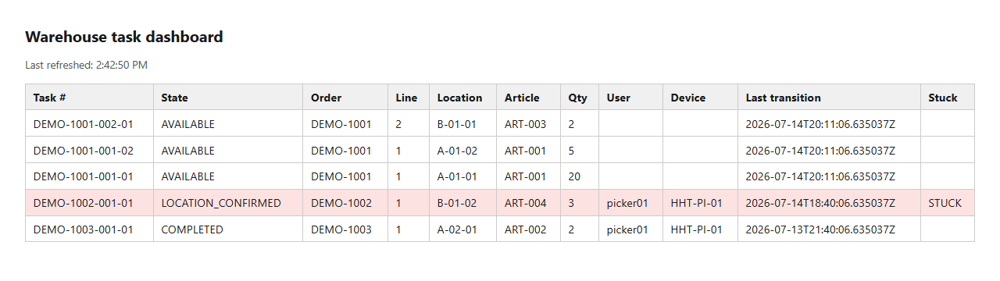
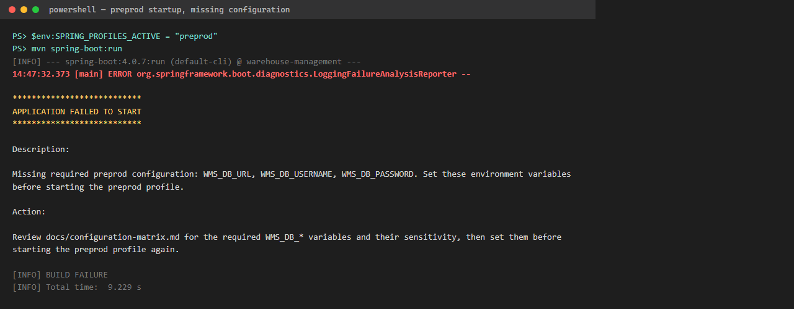

# Miniature Warehouse Management System

A Java 21 / Spring Boot proof of concept covering warehouse picking, SQL diagnostics, configuration discipline, functional test evidence, and operational supportability — end to end, from schema to HHT REST contract to admin dashboard.

## What this project demonstrates

Built to exercise the skills of an application configuration & testing / support role for warehouse management systems:

| Skill area | Where it lives |
|---|---|
| SQL and relational-data competence | `docs/sql-diagnostics.md` (stuck-task, ledger-reconciliation, order-trace, integrity-overview queries); append-only `stock_movement`/`task_transition` ledgers enforced by DB triggers (`src/main/resources/db/migration/V1__create_schema.sql`) |
| Intermediate Java / Spring application design | The full `/api/v1` REST surface (`API.md`): authentication, HHT claim/scan/confirm, admin order/task/catalog/stock endpoints, QR labels, dashboard |
| Configuration and parameterization discipline | `docs/configuration-matrix.md` (every parameter's owner, default, sensitivity, environment, restart requirement); preprod startup validation that fails fast and safely on missing or unsafe config |
| Functional test specification and execution | `docs/functional-test-specification.md` (19 numbered cases) and `docs/executed-test-report.md` (recorded pass/fail/blocked status with evidence citations, not just "it compiles") |
| Log-based diagnosis | `docs/log-analysis-guide.md` — structured JSON logs correlatable by request, order, task, user/device, article, location, and movement, without exposing credentials |
| Installation, operation, rollback, and incident documentation | `docs/runbook-windows.md` (clean-environment install, LAN firewall scoping, rollback), `docs/incident-record-template.md` |
| HHT (handheld terminal) integration pattern | The HHT is treated as a separate LAN REST client (`API.md`); a scoped firewall rule exposes only the API port, never the database |
| Extension seam for a flow-control / MFC layer | `OrderCompletionPublisher` port + no-op adapter (`docs/architecture.md`, ADR 0007), plus the real `telegram` adapter the MFC work package (`PLAN.md`, ADR 0011) implements behind it — transactional outbox, dispatcher retry, WCS confirmation endpoints; transport chosen by ADR, not a raw TCP implementation |

### Screenshots

The admin dashboard, live — seeded demo tasks, with the stuck task flagged and a "Last refreshed" timestamp confirming the client-side poll:



A generated QR location label, fetched directly from the label API:


The preprod profile refusing to start on missing configuration — a safe, actionable diagnostic instead of a stack trace or a silent bad connection:



More: [SQL diagnostics output](docs/evidence/2026-07-14-final-acceptance-sweep/sql-diagnostics.png) · [article label (A4 PDF)](docs/evidence/2026-07-14-final-acceptance-sweep/label-article.png) · [dashboard login page](docs/evidence/2026-07-14-final-acceptance-sweep/login.png) — all captured live against a running instance; see `docs/evidence/2026-07-14-final-acceptance-sweep.md` for exactly how each was produced.

## Ecosystem role

This WMS is the source of truth of a seven-repo warehouse-automation
ecosystem (integration map: `../ECOSYSTEM.md`). Two `/api/v1` client
generations pin this contract and are served unchanged as a deliberate
demonstration goal: the HandheldPi HHT (ecosystem name `hht-picker`, a
finish-then-freeze legacy client) and warehouse-android's `:app-picker`
(its successor, in progress). Downstream, `agv-fleet-controller` (the WCS)
consumes MFC mission telegrams and returns confirmations via REST; the
telegram contract `TELEGRAMS.md` is authored and owned in this repository.

## Current status

All ten delivery phases are implemented and evidenced. The one new scope package approved by the owner (2026-07-18, per `../ECOSYSTEM.md` v3) — the **MFC work package** (telegram contract + sender + mission endpoints, TRANSPORT first, SORT stubbed) — is also implemented and evidenced, all five acceptance gates satisfied (`PLAN.md`). `docs/executed-test-report.md` records **FT-01–FT-24: 25 Passed, 0 Failed, 0 Blocked, 0 Not Applicable**, and `mvn -B verify` passes on the pinned toolchain (43 integration tests, 0 Checkstyle violations, 0 SpotBugs findings). A final acceptance sweep (`docs/evidence/2026-07-14-final-acceptance-sweep.md`) additionally:

- executed the SQL diagnostic pack against a running development database, confirming every query's documented expected result;
- performed a runbook rehearsal from a fresh clone — package, preprod profile against a freshly created empty database, health check, clean shutdown — confirming only the schema migration applies and no dev fixtures or secrets leak (recorded caveat: the rehearsal used a fresh clone rather than a literal fresh machine, since the pinned toolchain was already installed; the firewall-scoping and cross-machine LAN steps were out of scope for a software-only rehearsal);
- exercised the live HTTP surface directly (login/claim/logout, dashboard session login and polling, byte-identical label regeneration, structured-log-to-ledger correlation, preprod fail-fast on both a missing variable and the committed dev password).

Delivered and evidenced (see `docs/evidence/` and `docs/executed-test-report.md`):

- Flyway-owned PostgreSQL schema with the approved order/line/task states, constraints, and append-only `stock_movement` and `task_transition` ledgers;
- the full `/api/v1` HHT and admin REST surface (`API.md`): authentication, FIFO claim/scan/confirm, admin order/task/catalog/stock endpoints;
- QR location/article labels (deterministic PNG/A4 PDF) and a session-authenticated, polling admin dashboard;
- preprod startup validation with a safe diagnostic, structured JSON operational logging, and the configuration matrix/runbook/log-analysis-guide/incident-record-template documentation set;
- the `OrderCompletionPublisher` MFC extension seam and its no-op adapter, with documented (not implemented) future TCP boundaries;
- migration/integrity/API/concurrency/idempotency/recovery integration tests against the digest-pinned `postgres:17.10-alpine` image, plus Checkstyle and SpotBugs, all in `mvn verify`.

### Confirmed workflow invariants

These hold across the whole implementation and are not incidental to any one endpoint:

1. Pick confirmations must equal the exact task quantity; partial picks are rejected.
2. The HHT has no skip operation; blocked work requires an administrative recovery path (block/resume).
3. Tasks are offered globally by order creation time, order-line number, and task sequence (FIFO).
4. Claims are atomic, and a user/device may have at most one active task.
5. An order line may be split across locations in ascending location-code order.
6. Stock is decremented only when a valid pick is confirmed.
7. The stock update, task completion, order/line progression, and movement insertion occur in one transaction.
8. `stock_movement` and `task_transition` are append-only audit ledgers, enforced at the database level.
9. The HHT is a separate LAN REST client, not a direct database consumer.
10. The MFC seam stands: the MFC work package (`PLAN.md`) implements it behind the ADR 0007 `OrderCompletionPublisher` seam, with transport chosen by ADR (ADR 0011: transactional outbox + HTTP push); raw TCP telegram sockets remain out of scope.

## Prerequisites — owner managed

This project is developed on both a 64-bit Windows workstation and a Linux Mint 22 desktop (ADR 0009 amends ADR 0002 for cross-platform provisioning; ADR 0010 amends the JDK pin); the application, tests, and `compose.yaml` are unchanged and OS-neutral either way. The project owner installs and updates workstation tools:

- **JDK:** any OpenJDK 21.x LTS distribution, at the latest patch its install channel offers (ADR 0010). Eclipse Temurin is the recommended default (Windows: Adoptium MSI/zip installer; Linux Mint 22: Adoptium's `apt` repository, `temurin-21-jdk`), but a distribution-packaged build such as Mint/Ubuntu's `openjdk-21-jdk` is equally valid. CI pins Temurin and remains the arbiter of build correctness.
- **Maven:** none to install — the committed wrapper (`mvnw` / `mvnw.cmd`) bootstraps Maven 3.9.16 on first run. A system Maven 3.9.16 install remains equally valid if already present.
- **Docker:** Docker Desktop with Compose v2 on Windows (virtualization enabled); Docker Engine (`docker-ce`, `docker-compose-plugin` from Docker's own `apt` repository) plus your user in the `docker` group on Linux Mint.

The project owner may collect version evidence from a new shell session:

```powershell
java -version
.\mvnw.cmd -v
docker --version
docker compose version
```

```bash
java -version
./mvnw -v
docker --version
docker compose version
```

## Start the development database and application

Docker Compose is the approved development route (ADR 0002); the image is pinned by immutable digest. Record first-start evidence per ADR 0006.

1. Optionally copy `.env.example` to `.env` and change development-only database values. Both Docker Compose and the Spring `dev` profile read this file.
2. Start PostgreSQL (identical on Windows and Linux):

   ```shell
   docker compose up -d
   docker compose ps
   ```

3. Start the application. Flyway creates and seeds the schema automatically:

   ```shell
   ./mvnw spring-boot:run       # Linux/macOS
   .\mvnw.cmd spring-boot:run   # Windows
   ```

4. Check database-backed application health:

   ```shell
   curl http://localhost:8080/actuator/health          # Linux/macOS
   ```
   ```powershell
   Invoke-RestMethod http://localhost:8080/actuator/health   # Windows
   ```

5. Open a SQL session when running the diagnostic pack (identical on both OSes):

   ```shell
   docker compose exec postgres psql -U wms -d wms
   ```

Development seed users are `admin` / `admin123`, `picker01` / `picker123`, and `picker02` / `2468` (numeric password for the HandheldPi PIN-pad login; its badge QR `OP:picker02` supplies the username). Seed devices are `HHT-PI-01` (physical handheld) and `HHT-DEV-01` (developer loopback client). They exist only to support the PoC and must not be reused outside development.

## Build and test

This is the validated verification path (see `docs/evidence/2026-07-13-phase6-maven-verify.md`). The test suite is integration-only (Failsafe `*IT` classes, each backed by its own disposable Testcontainers PostgreSQL instance) — there are no plain unit tests, so `mvn test`/`./mvnw test` runs zero tests:

```shell
./mvnw verify       # Linux/macOS
.\mvnw.cmd verify   # Windows
```

`verify` compiles, runs all integration tests (migrations, seed reconciliation, credentials, append-only movement enforcement, auth, picking, admin, labels, dashboard, config, logging, MFC seam), then Checkstyle and SpotBugs. A working Docker runtime is required (Testcontainers talks to the local Docker socket on either OS).

## Reset the development database

**This is destructive.** It permanently deletes local WMS database data and reruns all migrations on the next start (identical on both OSes):

```shell
docker compose down -v
docker compose up -d
```

Never use volume deletion as a preproduction recovery procedure.

## Configuration

The default profile is `dev`. It adds `db/devdata` to Flyway and therefore installs demonstration fixtures. Preproduction scans only `db/migration`, has no committed credentials or demo users, and fails when required database environment variables are absent or set to the committed development password.

| Variable | Development default | Purpose |
|---|---:|---|
| `SPRING_PROFILES_ACTIVE` | `dev` | Selects `dev` or `preprod` |
| `WMS_DB_URL` | `jdbc:postgresql://localhost:5432/wms` | JDBC connection URL |
| `WMS_DB_USERNAME` | `wms` | Database login |
| `WMS_DB_PASSWORD` | `wms_dev_password` | Database password |
| `WMS_DB_NAME` | `wms` | Compose database name |
| `WMS_DB_PORT` | `5432` | Compose host-side database port |
| `WMS_SERVER_ADDRESS` | `0.0.0.0` | API bind address |
| `WMS_SERVER_PORT` | `8080` | API and dashboard port |
| `WMS_TASK_STUCK_THRESHOLD` | `PT30M` | Active-state age treated as stuck |
| `WMS_AUTH_TOKEN_TTL` | `PT8H` | HHT token lifetime |
| `WMS_DASHBOARD_POLL_INTERVAL` | `PT2S` | Admin dashboard client-side polling interval |
| `WMS_MFC_ADAPTER` | `noop` | Selects the `OrderCompletionPublisher` adapter; `noop` is the only implemented value |

Local secrets belong in `.env` or process environment variables, never committed files. Only the application port will be opened to the LAN in the installation runbook; Compose binds PostgreSQL to `127.0.0.1` deliberately. `docs/configuration-matrix.md` is the authoritative, complete reference (owner, sensitivity, environment, restart requirement for every parameter); the table above is a quick-start subset.

## Docker Compose versus native PostgreSQL

Docker Compose is the approved primary route (ADR 0002, decision D-02) because it pins the PostgreSQL image by immutable digest, creates the database consistently, keeps extensions and data isolated, and makes reset/integration testing reproducible. The tradeoff is Docker's installation size, memory use, virtualization dependency (Windows), or daemon/group setup (Linux), and possible corporate licensing/policy restrictions.

A native PostgreSQL 17 installation remains the documented fallback on either OS. It starts faster and avoids a container layer, but service setup, `pg_hba.conf`, extension availability, upgrades, data cleanup, and troubleshooting become machine-specific — Windows service configuration versus a Linux systemd unit and package-manager-owned data directory. If a native PostgreSQL instance already occupies port 5432, override `WMS_DB_PORT` for the Compose container rather than stopping the native service.

## Cross-platform development

This project is developed on both a Windows workstation and a Linux Mint 22 desktop. Nothing in the application, `pom.xml`, `compose.yaml`, or the test suite is OS-specific — only tool *provisioning* differs, and that is now handled either identically (the Maven Wrapper) or via matched per-OS steps (JDK, Docker). See ADR 0009 (`docs/decisions/0009-cross-platform-developer-provisioning.md`) for the full rationale, and `docs/runbook-linux.md` for the Linux Mint 22 counterpart to `docs/runbook-windows.md`.

The Linux Mint 22 machine was provisioned and the full suite executed on it on 2026-07-15: 33/33 integration tests pass with no application, schema, or dependency change, confirming that OS-neutrality claim on real hardware rather than by inspection. That run also relaxed the JDK pin to any OpenJDK 21.x LTS build (ADR 0010) and corrected two `docs/runbook-linux.md` defects found by following it literally. See `docs/evidence/2026-07-15-linux-mint-provisioning.md`, including what was *not* verified (the `ufw` rule, LAN/HHT reachability, and the `preprod` runtime rehearsal).

## Key documents

- `API.md` — the implemented and evidenced HHT/admin REST contract, plus the label and dashboard endpoints.
- `PLAN.md` — the approved MFC work package: telegram contract, sender, mission endpoints, and acceptance gates.
- `handheld-plan.md` — the HandheldPi LAN integration plan (contract adaptation, offline queue, evidence).
- `docs/configuration-matrix.md` — every parameter's owner, default, sensitivity, environment, and restart requirement.
- `docs/runbook-windows.md` — clean-environment Windows install, firewall scoping, LAN/HHT check, and rollback.
- `docs/runbook-linux.md` — the Linux Mint 22 counterpart: clean-environment install, `ufw` scoping, LAN/HHT check, and rollback.
- `docs/sql-diagnostics.md` — stuck-task, ledger-reconciliation, and order-trace SQL.
- `docs/log-analysis-guide.md` — structured-log field reference and worked diagnosis examples.
- `docs/incident-record-template.md` — the template for recording a real operational incident.
- `docs/architecture.md` — module boundaries, transactions, and the MFC seam.
- `docs/decisions/` — ADRs 0001–0010; ADR 0002 records the approved technology baseline, amended by ADR 0009 for cross-platform provisioning and ADR 0010 for the vendor-neutral JDK 21 pin.
- `docs/evidence/` — retained runtime and test evidence per build/configuration identifier.
- `docs/functional-test-specification.md`, `docs/requirements-traceability.md`, and `docs/executed-test-report.md` — numbered cases, requirement mapping, and aggregated pass/fail/blocked status for FT-01–FT-19.
- `docs/research/` — early research, decision packet, and validation log from the design phase.

## Repository layout

```text
.github/workflows/       CI pipeline
src/main/java/           Spring Boot application modules (auth, picking, admin, label, dashboard, mfc, ...)
src/main/resources/      profile configuration and Flyway migrations
src/test/java/           PostgreSQL-backed integration tests (Testcontainers)
docs/                    diagnostics, decisions, specifications, evidence, and runbooks
compose.yaml              local PostgreSQL service
```
