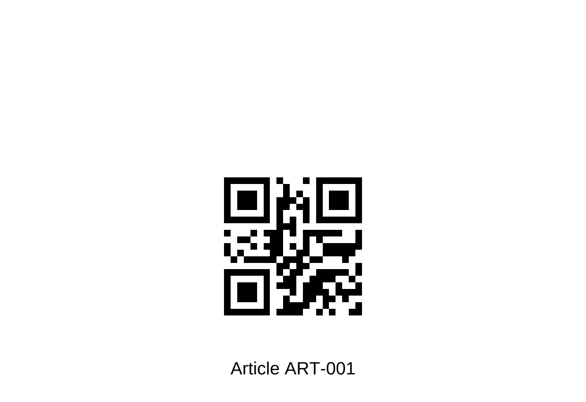

# Manual del administrador de almacén

**Público:** personal autorizado para mantener artículos, ubicaciones,
existencias, órdenes, etiquetas y recuperaciones\
**Nivel:** administración de negocio\
**Estado:** borrador inicial; pendiente de validación con un administrador

## Su responsabilidad

El administrador prepara la información que permite trabajar al almacén y ejecuta
las recuperaciones autorizadas por el supervisor o soporte.

Cada cambio debe ser correcto, estar autorizado y conservar una razón verificable.
Una acción administrativa puede afectar a varios preparadores, tareas y movimientos
de existencias.

## Limitación importante del prototipo

El proyecto todavía no tiene una pantalla completa para estas acciones. El tablero
solo permite consultar tareas.

Para crear artículos, ubicaciones y órdenes, ajustar existencias, generar etiquetas
o recuperar tareas se utiliza una interfaz técnica llamada REST. Una persona
autorizada puede ejecutar las solicitudes usando una herramienta administrativa
preparada para este fin.

La guía de negocio está en este capítulo. Los datos exactos que debe enviar la
herramienta están en la
[Referencia técnica de administración](anexos/referencia-tecnica-administracion.md).

## Acciones disponibles

| Acción | ¿Disponible? | Observación |
|---|---|---|
| Crear un artículo | Sí | No existe función para editarlo o eliminarlo después |
| Crear una ubicación | Sí | No existe función para editarla o eliminarla después |
| Ajustar existencias | Sí | Todo ajuste necesita una razón y queda registrado |
| Crear una orden | Sí | No existe función para editarla o cancelarla después |
| Consultar una orden | Sí | Muestra líneas, cantidades y tareas |
| Consultar tareas | Sí | También se pueden observar en el tablero |
| Bloquear y reanudar una tarea | Sí | Solo como recuperación autorizada |
| Generar etiquetas | Sí | Ubicaciones y artículos; no genera gafetes de operador |
| Crear usuarios o terminales | No | Se preparan fuera de estas funciones |
| Recepción, devoluciones o inventario cíclico completo | No | Fuera del alcance actual del prototipo |

Como no existe edición o cancelación, revise dos veces los datos antes de confirmar
una creación.

## 1. Prepararse para una acción administrativa

Antes de cualquier cambio:

1. Confirme que la solicitud proviene de una persona autorizada.
2. Identifique el ambiente correcto. No confunda demostración con preproducción.
3. Compruebe la dirección del sistema.
4. Inicie sesión con su propia cuenta `ADMIN`.
5. Registre la fecha, hora y motivo de la acción.
6. Prepare los datos y pida una segunda revisión cuando el cambio afecte
   existencias o una orden real.

**No haga esto:** no utilice las cuentas de demostración fuera del ambiente de
desarrollo y no copie claves o sesiones de acceso en registros, capturas o correos.

## 2. Crear un artículo

Un artículo necesita:

- un código único;
- una descripción clara.

El código puede tener de 1 a 50 caracteres. Solo admite letras mayúsculas, números,
guion `-` y guion bajo `_`.

Ejemplos válidos:

- `ART-005`
- `CAMISETA_NEGRA_M`
- `REPUESTO-2026-01`

Antes de crearlo:

1. Busque si el código ya existe en el catálogo autorizado.
2. Compare descripción, presentación y unidad de manejo.
3. Confirme que el código está escrito en mayúsculas.
4. Recuerde que el prototipo no permite corregirlo después.

Después de crearlo:

1. Compruebe que el sistema devuelve el mismo código y descripción.
2. Compruebe que el artículo aparece activo.
3. Genere una etiqueta de prueba.
4. Escanee la etiqueta antes de imprimir el lote completo.
5. Registre quién aprobó el alta.

El contenido QR se forma automáticamente como `ART:` seguido del código. No lo
escriba manualmente en otro generador de etiquetas.

## 3. Crear una ubicación

El código de ubicación debe seguir este formato:

```text
LETRA-00-00
```

Ejemplos: `A-01-01`, `B-02-15` o `PASILLO-03-08`.

También requiere una secuencia de recorrido positiva y única. Esta secuencia queda
reservada para una futura mejora. En el prototipo actual, la asignación utiliza el
código de ubicación en orden alfabético, no la secuencia de recorrido.

Antes de crearla:

1. Compruebe físicamente el pasillo y la posición.
2. Revise el plano o catálogo de ubicaciones.
3. Confirme que el código no existe.
4. Confirme que la secuencia no está asignada a otra ubicación.
5. Recuerde que el prototipo no permite corregirla después.

Después de crearla:

1. Genere la etiqueta PDF.
2. Imprímala sin recortar el código QR.
3. Compruebe que el texto visible coincide con la ubicación física.
4. Escanéela con una terminal antes de instalarla.
5. Colóquela de forma que no pueda confundirse con una posición vecina.

## 4. Generar etiquetas

El sistema genera etiquetas para ubicaciones y artículos en dos formatos:

- PDF de una página A4, recomendado para imprimir;
- PNG cuadrado, útil para comprobación o integración.

Etiqueta de ubicación:


Ejemplo de etiqueta de artículo en PDF:



Procedimiento:

1. Seleccione si necesita una etiqueta de ubicación o artículo.
2. Introduzca exactamente el código existente.
3. Solicite el formato PDF para impresión.
4. Compruebe el texto visible.
5. Imprima a tamaño normal, sin usar “ajustar y recortar”.
6. Escanee una muestra con la terminal.
7. Instale o entregue las etiquetas únicamente después de la prueba.

**No haga esto:** no modifique el contenido del QR con un editor de imágenes. Los
códigos distinguen mayúsculas y minúsculas y deben coincidir exactamente.

Los gafetes de preparador usan otra convención y no se generan con estas funciones.

## 5. Registrar o corregir existencias

El prototipo utiliza ajustes con signo:

- un número positivo aumenta la cantidad;
- un número negativo reduce la cantidad.

Ejemplos:

| Situación verificada | Ajuste |
|---|---:|
| El sistema indica 20 y el conteo correcto es 24 | `+4` |
| El sistema indica 20 y el conteo correcto es 17 | `-3` |

Cada ajuste necesita:

- artículo;
- ubicación;
- aumento o reducción;
- razón concreta.

Antes de ajustar:

1. Realice o solicite un segundo conteo físico.
2. Compruebe artículo y ubicación.
3. Revise si existen tareas abiertas para esa combinación.
4. Compruebe si alguna terminal muestra información pendiente `Q:`.
5. Revise el historial con soporte cuando exista una preparación dudosa.
6. Calcule la cantidad que resultará después del ajuste.
7. Obtenga la autorización exigida por el almacén.

**Precaución:** el prototipo evita que el resultado sea menor que cero, pero no
impide que una reducción deje menos unidades que las ya destinadas a tareas
abiertas. Si existen tareas abiertas, no reduzca las existencias sin revisar el
caso con soporte.

Una razón adecuada sería:

> Conteo cíclico CC-2026-07-15; segundo conteo confirmó 17 unidades físicas en
> A-01-01, frente a 20 registradas.

Una razón inadecuada sería:

> Corrección.

Después del ajuste:

1. Compruebe el artículo y la ubicación devueltos por el sistema.
2. Compruebe el aumento o reducción aplicado.
3. Compruebe la cantidad resultante.
4. Registre el número del movimiento.
5. Si la respuesta se perdió o agotó el tiempo de espera, no repita el ajuste.
   Solicite a soporte comprobar el historial primero.

**No haga esto:** repetir un ajuste después de una respuesta dudosa puede aplicarlo
dos veces.

## 6. Crear una orden

Una orden contiene:

- un número único;
- una o más líneas;
- un número de línea distinto para cada renglón;
- un artículo existente por línea;
- una cantidad mayor que cero.

El número de orden admite letras mayúsculas, números, guion y guion bajo, con un
máximo de 50 caracteres.

Antes de crearla:

1. Confirme que el número no fue utilizado.
2. Revise cada código de artículo.
3. Revise cada número de línea.
4. Revise cada cantidad.
5. Compruebe que las existencias disponibles son suficientes.
6. Recuerde que el prototipo no permite editar o cancelar la orden.
7. Solicite una segunda revisión de los datos.

El sistema crea la orden completa o no crea nada. Si falta un artículo o no existen
suficientes unidades disponibles para cualquier línea, no se crea ninguna parte de
la orden.

Las unidades ya destinadas a tareas sin terminar no se consideran disponibles para
una orden nueva. Si un artículo necesita recogerse desde varias ubicaciones, el
sistema crea varias tareas en orden ascendente por código de ubicación.

Después de crearla:

1. Compruebe el número de orden.
2. Compruebe el estado `OPEN`.
3. Compare el número de líneas con la solicitud original.
4. Revise cuántas tareas fueron creadas.
5. Consulte el detalle de la orden.
6. Verifique ubicaciones, artículos y cantidades de las tareas.
7. Conserve la confirmación de creación.

Si aparece `ORDER_ALREADY_EXISTS`, no cambie ligeramente el número para evitar el
mensaje. Primero averigüe si la orden ya fue creada correctamente.

## 7. Consultar el avance de una orden

La consulta de una orden muestra:

- estado general;
- fecha de creación y terminación;
- líneas y cantidades solicitadas;
- cantidades ya preparadas;
- tareas, ubicaciones y estados.

Estados de la orden o línea:

| Estado | Significado |
|---|---|
| `OPEN` | Creada, todavía sin avance completo |
| `IN_PROGRESS` | Al menos una parte está en preparación |
| `COMPLETED` | Todas las tareas necesarias terminaron |

Una línea termina únicamente cuando terminan todas sus tareas. La orden termina
únicamente cuando terminan todas sus líneas.

## 8. Ejecutar un bloqueo autorizado

El supervisor decide operativamente cuándo una tarea debe detenerse. El
administrador ejecuta la acción autorizada.

Antes de bloquear:

1. Reciba el número o identificador exacto de la tarea.
2. Reciba una razón concreta.
3. Confirme con el supervisor si la terminal muestra `Q:`.
4. Consulte el estado actual.
5. No bloquee una tarea ya completada.
6. Genere o conserve el identificador de seguimiento de la solicitud.

Después de bloquear:

1. Compruebe que el estado sea `BLOCKED`.
2. Compruebe que la razón devuelta coincida.
3. Informe al supervisor que el preparador y la terminal fueron liberados.
4. Registre la hora y la persona que ejecutó la acción.

Bloquear no cambia las existencias. También elimina los escaneos confirmados de esa
tarea para que, al reanudarse, comience nuevamente desde la ubicación.

## 9. Ejecutar una reanudación autorizada

Antes de reanudar:

1. Confirme que la tarea está `BLOCKED`.
2. Revise la razón del bloqueo.
3. Confirme quién resolvió la causa y cómo.
4. Confirme que no queda información pendiente en la terminal anterior.
5. Registre la autorización del supervisor.

Después de reanudar:

1. Compruebe que el estado sea `AVAILABLE`.
2. Informe al supervisor.
3. Explique que la tarea se ofrecerá nuevamente siguiendo el orden normal.

Reanudar no cambia las existencias y no asigna directamente la tarea a una persona.

## 10. Cerrar una sesión administrativa

1. Confirme que recibió una respuesta para la última acción.
2. Registre los números de movimiento, orden o tarea necesarios.
3. Cierre la sesión de la herramienta administrativa.
4. Cierre el tablero si está en un equipo compartido.
5. No conserve la sesión de acceso en archivos de texto, notas o capturas.

## Errores que requieren detenerse

| Mensaje o situación | Acción |
|---|---|
| Datos no válidos | Corrija los datos; no cambie otros campos al azar |
| Artículo o ubicación no encontrados | Compruebe el catálogo antes de crear o ajustar |
| Registro ya existente | Consulte el registro existente; no cree una variante improvisada |
| Existencias insuficientes | No se creó la orden; revise cantidades y reservas |
| El ajuste dejaría cantidad negativa | Deténgase y revise conteo y signo |
| Sesión vencida | Inicie sesión nuevamente; no reutilice una sesión antigua |
| Sin permiso | Deténgase; no utilice la cuenta de otra persona |
| Respuesta dudosa después de un cambio | No repita; pida verificación a soporte |

## Registro mínimo de una acción

| Dato | Valor |
|---|---|
| Fecha y hora | |
| Ambiente | Desarrollo / Preproducción |
| Persona solicitante | |
| Persona que autorizó | |
| Persona que ejecutó | |
| Tipo de acción | Artículo / Ubicación / Existencias / Orden / Tarea / Etiqueta |
| Identificadores afectados | |
| Motivo | |
| Resultado | |
| Identificador de seguimiento | |
| Evidencia conservada | |

Para recordar las comprobaciones principales, consulte la
[Guía rápida del administrador](referencia-rapida/guia-rapida-administrador.md).
