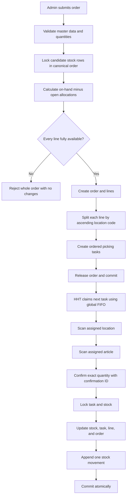
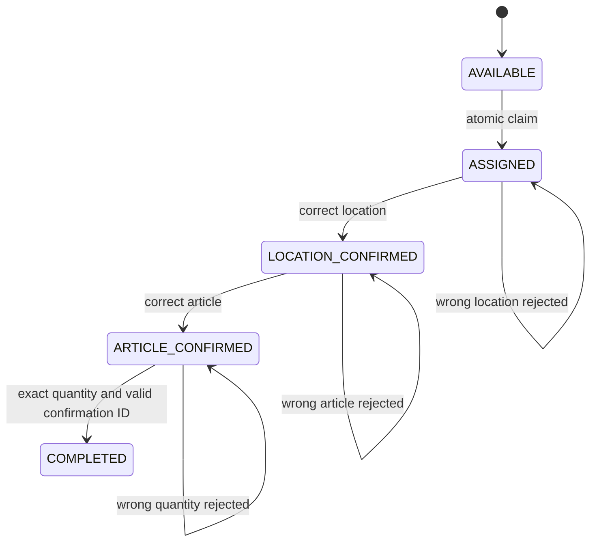
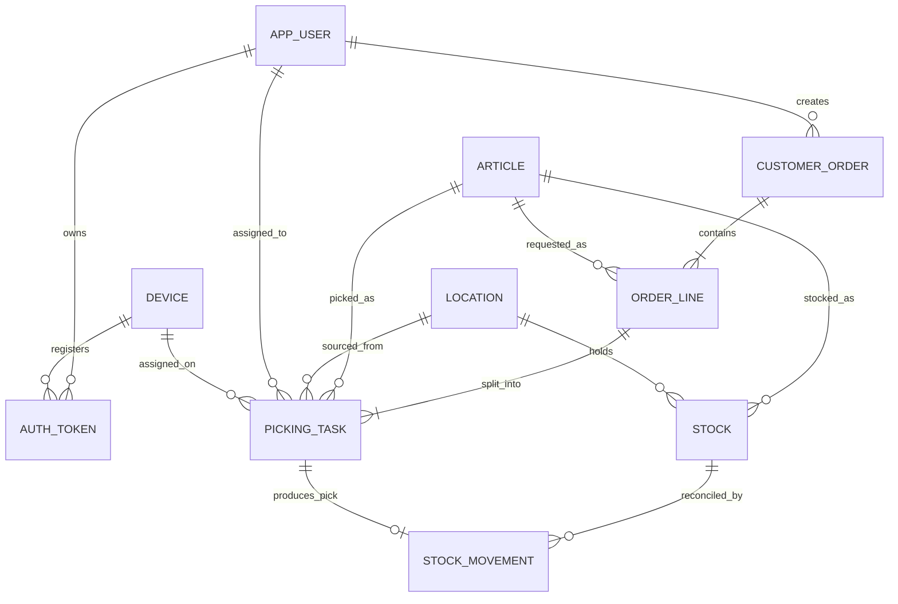

# Phase 2 research synthesis

**Status:** Draft research output; not an approved design  
**Access date:** 2026-07-12  
**Authority:** `PLAN.md` remains the project roadmap and approval source

## Purpose and boundaries

This document consolidates the Phase 2 research requested by `PLAN.md`. It
distinguishes source findings, project interpretations, proposed decisions, and
open questions. Nothing in this document opens the Phase 3 gate or authorizes
implementation.

The current source code, migration, API contract, configuration, CI workflow,
README, architecture document, and ADR 0001 remain provisional. They are
evidence of ideas already explored, not proof that a phase is complete.

No build, server, container, migration, or integration-test command was run
during this research. Section 16 lists workstation evidence commands for the
project owner to run separately.

Follow-up research artifacts:

- `provisional-artifact-inventory.md` classifies the workspace and records
  useful draft behavior without approving it.
- `phase-3-decision-packet.md` converts the open questions into proposals for
  owner review; it does not open the design gate.

## 1. Research coverage

| PLAN.md area | Coverage | Remaining work before approval |
|---|---|---|
| 2.1 Warehouse domain | Researched | Owner review of scope reductions and recovery behavior |
| 2.2 Java and Spring | Researched | Confirm exact supported versions and disputed choices |
| 2.3 PostgreSQL and migrations | Researched from official PostgreSQL, Flyway, and Testcontainers documentation plus provisional SQL | Validate proposed queries and migration policy after the design gate |
| 2.4 Testing and operations | Researched | Approve evidence, logging, CI, and runbook standards |
| 2.5 Research outputs | Drafted in this document | Review, resolve open questions, then update `PLAN.md` only when evidence supports it |

## 2. Source register

All web sources were accessed on 2026-07-12.

| ID | Publisher | Source | URL | Concise finding |
|---|---|---|---|---|
| WMS-01 | Microsoft | Warehouse management overview | https://learn.microsoft.com/en-us/dynamics365/supply-chain/warehousing/warehouse-management-overview | Enterprise WMS configuration commonly separates waves, work templates, work pools, location directives, and worker traceability. |
| WMS-02 | Microsoft | Wave processing | https://learn.microsoft.com/en-us/dynamics365/supply-chain/warehousing/wave-processing | Order lines can be reserved, grouped, and released before warehouse work is created. |
| WMS-03 | Microsoft | Reservations in Warehouse Management | https://learn.microsoft.com/en-us/dynamics365/supply-chain/warehousing/reservations-in-warehouse-management | Reservation hierarchies separate strict allocation dimensions from later location selection. |
| WMS-04 | Microsoft | Reserve inventory quantities | https://learn.microsoft.com/en-us/dynamics365/supply-chain/inventory/reserve-inventory-quantities | Reservation timing and FIFO/FEFO policies are configurable; over-reservation is rejected. |
| WMS-05 | Microsoft | Cancel warehouse work | https://learn.microsoft.com/en-us/dynamics365/supply-chain/warehousing/cancel-warehouse-work | Blocked work is recovered through controlled administrative operations rather than direct data edits. |
| WMS-06 | Microsoft | Location directives | https://learn.microsoft.com/en-us/dynamics365/supply-chain/warehousing/create-location-directive | Location selection is rule-driven and can explicitly allow one line to split across locations. |
| WMS-07 | Stripe | Designing robust and predictable APIs with idempotency | https://stripe.com/blog/idempotency | A client-generated key lets a server identify retries after ambiguous network failures and avoid duplicate effects. |
| WMS-08 | Martin Fowler | Idempotent Receiver | https://martinfowler.com/articles/patterns-of-distributed-systems/idempotent-receiver.html | Receivers can retain request identifiers and return the prior result for duplicate requests. |
| WMS-09 | Microsoft | Retry pattern | https://learn.microsoft.com/en-us/azure/architecture/patterns/retry | Transient failures should use bounded retries and backoff; permanent failures should not be retried blindly. |
| PG-01 | PostgreSQL Global Development Group | SELECT locking clause | https://www.postgresql.org/docs/current/sql-select.html#SQL-FOR-UPDATE-SHARE | `SKIP LOCKED` skips rows that cannot be locked immediately and is suitable for queue-like consumers, but it presents an inconsistent view. |
| PG-02 | PostgreSQL Global Development Group | Explicit locking | https://www.postgresql.org/docs/current/explicit-locking.html | Row locks last to transaction end; consistent lock order is the primary deadlock defense; PostgreSQL aborts one deadlocked transaction. |
| PG-03 | PostgreSQL Global Development Group | Transaction isolation | https://www.postgresql.org/docs/current/transaction-iso.html | `READ COMMITTED` is the default and uses a new statement snapshot; explicit row locks are needed for write invariants. |
| PG-04 | PostgreSQL Global Development Group | Partial indexes | https://www.postgresql.org/docs/current/indexes-partial.html | Partial indexes can reduce index size and partial unique indexes can enforce uniqueness only for rows matching a predicate. |
| PG-05 | PostgreSQL Global Development Group | SQL dump backup | https://www.postgresql.org/docs/current/backup-dump.html | `pg_dump` creates a consistent logical export that can be restored with PostgreSQL tools. |
| FW-01 | Redgate | Flyway migrations | https://documentation.red-gate.com/flyway/flyway-concepts/migrations | Versioned migrations are ordered, tracked in the schema history table, and intended to produce repeatable deployments. |
| FW-02 | Redgate | Flyway validate | https://documentation.red-gate.com/flyway/reference/commands/validate | Validation compares discovered migrations with schema-history records and reports missing or checksum-mismatched migrations. |
| FW-03 | Redgate | Flyway repair | https://documentation.red-gate.com/flyway/reference/commands/repair | Repair changes schema-history metadata; it is not a substitute for understanding or correcting a bad database state. |
| TC-01 | Testcontainers | PostgreSQL module | https://java.testcontainers.org/modules/databases/postgres/ | PostgreSQL containers require both the Testcontainers module and a JDBC driver and can use an explicitly selected image. |
| TC-02 | Testcontainers | Container lifecycle | https://testcontainers.com/guides/testcontainers-container-lifecycle/ | Container lifecycle patterns must match test-context reuse; a shared singleton must not be combined incorrectly with per-class lifecycle annotations. |
| JAVA-01 | Spring | Spring Boot system requirements | https://docs.spring.io/spring-boot/system-requirements.html | The selected Spring Boot line determines supported Java, Maven, servlet, persistence, and library baselines. |
| JAVA-02 | Spring | Spring Data JPA locking | https://docs.spring.io/spring-data/jpa/reference/jpa/locking.html | Repository methods can request pessimistic locks; PostgreSQL-specific `SKIP LOCKED` still requires native SQL. |
| JAVA-03 | Spring | Declarative transaction management | https://docs.spring.io/spring-framework/reference/data-access/transaction/declarative/annotations.html | Transaction boundaries can be declared at service methods and configured for propagation, isolation, timeout, and rollback. |
| JAVA-04 | IETF | RFC 9457 Problem Details for HTTP APIs | https://www.rfc-editor.org/info/rfc9457/ | Standard problem responses define `type`, `title`, `status`, `detail`, and `instance`, with extension members allowed. |
| JAVA-05 | Spring | Password storage | https://docs.spring.io/spring-security/reference/features/authentication/password-storage.html | Passwords should use adaptive one-way functions and long-term credentials should be exchanged for shorter-lived credentials. |
| JAVA-06 | OWASP | Password Storage Cheat Sheet | https://cheatsheetseries.owasp.org/cheatsheets/Password_Storage_Cheat_Sheet.html | Argon2id is preferred; bcrypt is an acceptable constrained alternative when configured with an appropriate work factor. |
| JAVA-07 | Spring | Structured logging | https://docs.spring.io/spring-boot/reference/features/logging.html | Spring Boot supports structured output and MDC fields; sensitive-value filtering remains an application responsibility. |
| JAVA-08 | Apache Maven | Build lifecycle | https://maven.apache.org/guides/introduction/introduction-to-the-lifecycle.html | Maven supplies a fixed lifecycle through `test`, `package`, and `verify`, which supports editor-independent builds. |
| JAVA-09 | JetBrains | Mixing Java and Kotlin | https://kotlinlang.org/docs/mixing-java-kotlin-intellij.html | Mixed Maven builds require deliberate compiler order and Spring/JPA compiler plugins. |
| JAVA-10 | ZXing | ZXing repository | https://github.com/zxing/zxing | ZXing provides QR encoding directly from Maven Central under Apache-2.0 but is maintained conservatively. |
| JAVA-11 | Apache | PDFBox | https://pdfbox.apache.org/ | PDFBox creates PDFs and embeds images/fonts under Apache-2.0. |
| TEST-01 | Apache Maven | Surefire plugin | https://maven.apache.org/surefire/maven-surefire-plugin/ | Surefire runs unit tests in Maven's `test` phase. |
| TEST-02 | Apache Maven | Failsafe plugin | https://maven.apache.org/surefire/maven-failsafe-plugin/ | Failsafe runs integration tests through `integration-test` and checks results in `verify`, allowing teardown first. |
| TEST-03 | Spring | Testing Spring Boot applications | https://docs.spring.io/spring-boot/reference/testing/spring-boot-applications.html | Slice tests and full-context tests serve different purposes and should be selected deliberately. |
| OPS-01 | GitHub | Secure use reference | https://docs.github.com/en/actions/reference/security/secure-use | Workflows should use least privilege and immutable action references where practical. |
| OPS-02 | GitHub | Dependency caching | https://docs.github.com/en/actions/reference/workflows-and-actions/dependency-caching | `setup-java` can manage Maven dependency caching using project dependency files as keys. |
| OPS-03 | Microsoft | Windows Firewall configuration | https://learn.microsoft.com/en-us/windows/security/operating-system-security/network-security/windows-firewall/configure | Inbound rules can be restricted by TCP port, remote address scope, and network profile. |

### Source quality note

Official product and standards documentation is preferred above. General
warehouse terminology was also cross-checked against secondary sources during
research, but no project decision below depends only on Wikipedia or an
unverified vendor claim. Live version numbers and support windows must be
rechecked at the Phase 3 checkpoint.

## 3. Warehouse-domain findings

### Source findings

1. Enterprise WMS products commonly separate reservation, release, wave
   planning, work generation, task execution, and exception recovery.
2. A small PoC may deliberately collapse release and work generation when wave
   optimization is out of scope.
3. Available stock is conceptually different from physical on-hand stock because
   open allocations reserve part of the balance.
4. Multi-location allocation is common; enterprise systems usually make the
   location-selection strategy configurable.
5. Handheld workflows normally use controlled state transitions and scan
   validation. Wrong scans must not advance work.
6. Blocked work needs an administrative recovery path with an audit trail.
7. Ambiguous LAN failures make mutating HHT operations candidates for
   idempotency keys and bounded retry behavior.
8. Inventory supportability depends on an immutable movement history and the
   ability to reconcile movements to current balances.
9. WMS business ownership and real-time equipment-control ownership should be
   separated by a small integration contract.

### Project interpretation

The confirmed workflow is a proportionate waveless picking design:

- order creation performs allocation, task creation, and release atomically;
- availability is on-hand stock minus quantities allocated to unfinished tasks;
- allocation greedily consumes locations in ascending location-code order;
- one task is created per article/location allocation slice;
- the HHT confirms location, then article, then exact quantity;
- wrong scans and rejected quantities preserve the current state;
- final confirmation is retry-safe and performs all stock and workflow changes
  in one transaction;
- blocked work is recovered administratively, never by an HHT skip;
- order completion emits only an application-level extension event.

Wave planning, route optimization, partial picks, short picks, automatic task
release, robotics, and TCP telegram delivery remain explicit exclusions unless
approved later.

## 4. Proposed workflow and state diagrams

These diagrams are research proposals, not approved implementation.





Administrative recovery must define an auditable transition from a blocked
active state. Automatic timeout release is not assumed.

## 5. Entity and relationship outline



### Relationship rules to preserve

- An order line references one article.
- Every task references the same article as its line.
- Every task's article/location pair must exist in stock.
- A task's quantities sum to its line's requested quantity at release.
- At most one active task belongs to a user and at most one to a device.
- A successful picking task produces exactly one `PICK` movement.
- A movement referencing a task must also reference the matching order line,
  article, and location.

## 6. Stock, allocation, task, movement, and idempotency invariants

| ID | Invariant |
|---|---|
| INV-01 | `stock.quantity` is never negative. |
| INV-02 | Available quantity equals on-hand quantity minus quantities allocated to unfinished tasks. |
| INV-03 | Order creation either creates all lines/tasks and reservations or creates nothing. |
| INV-04 | Multi-bin task slices are generated in ascending location-code order. |
| INV-05 | Only one active task may exist per assigned user and per assigned device. |
| INV-06 | A task can move only through the approved state sequence. |
| INV-07 | Wrong scans, invalid states, and quantity mismatches produce no stock or movement change. |
| INV-08 | Confirmed quantity must equal requested task quantity. |
| INV-09 | Stock changes only during a successful confirmation, receipt, or approved adjustment. |
| INV-10 | Each stock change appends exactly one matching movement in the same transaction. |
| INV-11 | `stock_movement` is never updated or deleted. |
| INV-12 | A successful task confirmation creates at most one `PICK` movement. |
| INV-13 | Repeating the same confirmation ID and payload returns the prior result without another decrement. |
| INV-14 | Reusing a confirmation ID for different work or payload is rejected. |
| INV-15 | A line completes only when its approved task quantities are complete. |
| INV-16 | An order completes only when all lines complete. |
| INV-17 | Credentials, clear bearer tokens, and password hashes are never logged. |

The provisional migration already attempts several of these constraints through
foreign keys, checks, partial unique indexes, movement triggers, and a unique
confirmation ID. Their design remains subject to the Phase 5 audit.

## 7. Technology comparison matrix

| Decision | Option A | Option B | Option C | Research signal; not a decision |
|---|---|---|---|---|
| Build | Maven 3.9.x | Gradle | - | Maven best matches the portable enterprise-facing goal and existing ADR direction. |
| JVM language | Java 21 | Java plus Kotlin | - | Use Java only unless a later ADR identifies measurable Kotlin value. |
| Spring Boot line | Current 4.1 patch | Mature 4.0 patch | Unsupported/older 3.x line | Recheck official support and ecosystem compatibility at approval; do not select only because it is newest. |
| Persistence | JPA plus native locking queries | JPA plus `JdbcTemplate` for critical paths | jOOQ | JPA plus narrowly scoped native SQL is smallest; JDBC may make locking paths clearer; jOOQ adds code generation. |
| Transaction isolation | `READ COMMITTED` plus explicit locks | `REPEATABLE READ` | `SERIALIZABLE` | Explicit row locks at `READ COMMITTED` are likely proportionate; prove with concurrency tests. |
| Error format | RFC 9457 Problem Details | Existing custom envelope | - | RFC 9457 is standard, but changing the provisional API requires Phase 3 approval. |
| Password hashing | Argon2id | bcrypt | PBKDF2 | Argon2id follows OWASP preference; bcrypt reduces dependencies. Decide after workstation performance measurement. |
| HHT token | Opaque random token with stored hash | JWT | Server session | Opaque revocable DB token is simplest for the LAN PoC. |
| Dashboard | Thymeleaf plus polling | Separate SPA | HTMX/SSE | Server-rendered HTML plus small polling endpoint avoids a second build toolchain. |
| QR | ZXing directly | QRGen | Other barcode library | ZXing is available from Maven Central and permits deterministic settings. |
| PDF | Apache PDFBox | iText | OpenPDF | PDFBox has a compatible license and supports embedded fonts/images. |
| PostgreSQL runtime | Docker Compose | Native Windows service | - | Compose improves repeatability; native installation remains a policy/resource fallback. |

### Version caution

The provisional `pom.xml` uses Spring Boot `4.1.0`, Java 21, and a
`postgres:17.10-alpine` test image. These are not approved version choices.
Before Phase 3 approval, verify:

1. the exact current Spring Boot support status and Jackson compatibility;
2. the exact Maven 3.9.x version installed by the owner;
3. the Spring-managed Flyway, Hibernate, PostgreSQL JDBC, and Testcontainers
   versions;
4. compatibility between the selected PostgreSQL server, driver, Flyway, and
   Testcontainers image;
5. that every selected image/dependency is pinned to a reproducible version.

## 8. Proposed transaction and lock boundaries

### 8.1 Order creation and allocation

1. Validate the complete request before taking locks.
2. Resolve candidate stock rows for all lines.
3. Sort lock keys canonically by `(article_id, location_id)`.
4. Lock candidate stock rows in that order.
5. Recalculate availability while locks are held.
6. Reject the complete order if any line cannot be fully allocated.
7. Insert the order, lines, and deterministic task slices.
8. Release the order and commit.

Open issue: if allocation is derived only from task state, the query and index
strategy must prevent two concurrent order creations from over-allocating the
same stock. An explicit allocated quantity is an alternative, not a decision.

### 8.2 Next-task claim

Use one transaction around:

```sql
SELECT t.id
FROM picking_task t
JOIN order_line ol ON ol.id = t.order_line_id
JOIN customer_order o ON o.id = ol.order_id
WHERE t.status = 'AVAILABLE'
ORDER BY o.created_at, o.id, ol.line_number, t.task_sequence, t.id
FOR UPDATE OF t SKIP LOCKED
LIMIT 1;
```

Then assign the selected task before commit. The complete `ORDER BY` provides a
stable tie-breaker. `SKIP LOCKED` deliberately relaxes a perfect global view:
locked older tasks are temporarily bypassed. Therefore:

- FIFO means oldest currently claimable task, not strict no-bypass fairness;
- claims must be short transactions;
- starvation must be observable through stuck-task diagnostics;
- the database partial unique indexes remain the final guard for one active
  task per user and device.

The provisional indexes should be reviewed against the actual query plan after
implementation is authorized; file existence alone does not prove suitability.

### 8.3 Confirmation

1. Lock the task and verify ownership, state, and confirmation ID.
2. For a completed matching confirmation, return the prior result.
3. Lock the referenced stock row using the same canonical stock-key order.
4. Verify exact quantity and available physical stock.
5. Decrement stock.
6. Complete the task and progress its line and order.
7. Insert one matching `PICK` movement.
8. Commit all changes together.

The final canonical lock order must be identical across order creation,
confirmation, adjustment, receipt, and administrative recovery. The choice of
stock-first or task-first is open; consistency matters more than the label.

PostgreSQL detects deadlocks and aborts one transaction. Any retry policy must
be bounded, limited to known transient SQL states, and covered by a test; it
must not broadly retry validation or business conflicts.

## 9. Schema and migration research

### Constraint allocation

| Rule | Database responsibility | Application responsibility |
|---|---|---|
| Nonnegative stock | `CHECK` constraint | Return stable domain error before constraint failure where possible |
| Unique article/location identifiers | Unique constraints | Normalize and validate request format |
| One active task per user/device | Partial unique indexes | Return current assignment or stable conflict |
| Valid task states and completed quantities | Check constraints | Enforce transition sequence and ownership |
| Task/line/article/location consistency | Composite foreign keys | Build only valid task allocations |
| One pick movement per task | Unique constraint/index | Idempotent confirmation response |
| Movement append-only | Restrictive grants and/or mutation trigger | No update/delete repository operations |
| Stock/movement equality | Transactional service plus database validation trigger if approved | Update stock and append movement together |

### Migration and fixture policy

- Common schema migrations belong only in `db/migration`.
- Development fixtures and known demo credentials belong only in
  `db/devdata`.
- Preproduction must never scan the fixture location.
- A versioned migration that has reached a shared or retained environment is
  immutable; corrections use a new forward migration.
- `repair` may correct understood schema-history metadata. It must not be used
  to hide checksum drift or mark a partially correct schema as healthy.
- `validate` should run before deployment or as part of application startup and
  CI-equivalent verification.
- `clean` and volume deletion are development-only destructive operations and
  are not rollback procedures.

### Provisional V1 decision

`V1__create_schema.sql` predates the research gate. Before it is adopted as the
real baseline, the owner must choose one of these policies:

| Option | Use when | Consequence |
|---|---|---|
| Replace provisional V1 | No shared/retained database has accepted it | Produces a cleaner real baseline but requires destroying only disposable databases and recording the decision |
| Preserve V1 and add V2+ | Any meaningful environment has applied it, or audit continuity is preferred | Keeps immutable history but carries provisional design corrections forward |
| Baseline an existing schema | Adopting a non-Flyway schema | Not currently indicated; requires explicit evidence and careful baseline version selection |

No migration file should be edited until this decision is approved and the
affected databases are inventoried.

### Reconciliation and backup

The required reconciliation remains:

```text
current stock by article/location
    = sum of all movement deltas by article/location
```

Every mismatch is an incident, not an instruction to overwrite either side.
Capture logs, involved IDs, SQL output, migration version, and build/config
identifier before corrective action.

`pg_dump` is the preferred portable logical backup for the PoC. Backup and
restore commands belong in the Phase 9 runbook and must be rehearsed against a
disposable target before they count as evidence.

## 10. Configuration and secret-handling model

| Parameter | Dev default | Preprod | Sensitivity | Owner | Restart |
|---|---|---|---|---|---|
| `SPRING_PROFILES_ACTIVE` | `dev` | Explicit `preprod` | Internal | Application/operator | Yes |
| `WMS_DB_URL` | Local PostgreSQL URL | Required externally | Internal | Infrastructure | Yes |
| `WMS_DB_USERNAME` | `wms` | Required externally | Internal | Infrastructure | Yes |
| `WMS_DB_PASSWORD` | Development-only value | Required externally | Secret | Infrastructure | Yes |
| `WMS_DB_NAME` | `wms` for Compose | Environment-specific | Internal | Infrastructure | Container restart |
| `WMS_DB_PORT` | `5432` for Compose | Environment-specific | Internal | Infrastructure | Container restart |
| `WMS_SERVER_ADDRESS` | `0.0.0.0` | Approved LAN interface or explicit value | Internal/security relevant | Operator | Yes |
| `WMS_SERVER_PORT` | `8080` | Approved API port | Internal | Operator | Yes |
| `WMS_TASK_STUCK_THRESHOLD` | `PT30M` | Explicit operational value | Internal | Operations | Yes |
| `WMS_AUTH_TOKEN_TTL` | `PT8H` | Explicit security value | Security relevant | Security/application | Yes |

Rules:

- `.env` is development-only and remains ignored.
- No real credential, bearer token, private key, or workstation path is
  committed.
- Preproduction configuration fails closed when required database values are
  missing.
- Health output must not expose connection strings, usernames, or stack traces.
- PostgreSQL remains loopback-only for the Compose route; only the Spring API is
  considered for a scoped LAN firewall rule.

## 11. Logging and event-field catalogue

| Event | Level | Required fields | Never log |
|---|---|---|---|
| `STARTUP_VALIDATED` | INFO | build/config ID, profile, migration state, server port | DB password, full connection secret |
| `REQUEST_COMPLETED` | INFO | correlation ID, method, route template, status, duration | bearer token, request password |
| `AUTH_SUCCEEDED` | INFO | correlation ID, user ID/name, device code | password, token |
| `AUTH_FAILED` | WARN | correlation ID, normalized reason, device code if known | submitted password, token |
| `TASK_CLAIMED` | INFO | correlation ID, order, line, task, user, device, article, location | token |
| `TASK_STATE_CHANGED` | INFO | correlation ID, task, prior/new state, user, device | scanned secrets |
| `SCAN_REJECTED` | WARN | correlation ID, task, expected type, error code, user/device | token |
| `PICK_CONFIRMED` | INFO | correlation ID, confirmation ID, order, task, article, location, movement, quantity, resulting stock | token |
| `IDEMPOTENT_RETRY` | INFO | correlation ID, confirmation ID, task, prior movement, outcome | token |
| `STOCK_ADJUSTED` | WARN | correlation ID, article, location, delta, result, user, reason reference | credentials |
| `STOCK_INTEGRITY_ERROR` | ERROR | correlation ID, article, location, expected/actual, build/config ID | secrets |
| `ADMIN_RECOVERY` | WARN | correlation ID, task, prior/new state, admin, reason | credentials |
| `ORDER_COMPLETION_PUBLISHED` | INFO | correlation ID, order, event ID, adapter, outcome | transport secret |

The open logging-format decision is JSON structured logging versus stable
`key=value` output. Either format must preserve the catalogue and correlation
fields. A log aggregator is out of scope unless separately approved.

## 12. Provisional error-code catalogue

The existing `API.md` codes are provisional. Phase 3 must decide whether to
retain the current envelope or map them to RFC 9457 extension members.

| HTTP | Codes |
|---:|---|
| 400 | `MALFORMED_REQUEST` |
| 401 | `INVALID_CREDENTIALS`, `INVALID_TOKEN`, `TOKEN_EXPIRED`, `TOKEN_REVOKED` |
| 403 | `FORBIDDEN`, `USER_INACTIVE`, `DEVICE_INACTIVE` |
| 404 | `DEVICE_NOT_REGISTERED`, `TASK_NOT_FOUND`, `ORDER_NOT_FOUND`, `ARTICLE_NOT_FOUND`, `LOCATION_NOT_FOUND` |
| 409 | `DEVICE_ASSIGNMENT_CONFLICT`, `TASK_ASSIGNMENT_CONFLICT`, `TASK_NOT_ASSIGNED_TO_USER`, `INVALID_TASK_STATE`, `WRONG_LOCATION`, `WRONG_ARTICLE`, `CONFIRMATION_ID_REUSED`, `INSUFFICIENT_STOCK`, `ORDER_ALREADY_EXISTS`, `INSUFFICIENT_AVAILABLE_STOCK`, `ARTICLE_ALREADY_EXISTS`, `LOCATION_ALREADY_EXISTS`, `PICK_SEQUENCE_ALREADY_EXISTS`, `NEGATIVE_RESULTING_STOCK` |
| 422 | `VALIDATION_FAILED`, `QUANTITY_MISMATCH` |

Each final code needs: HTTP status, stable title, safe message, allowed detail
fields, triggering invariant, retry guidance, log event, and numbered tests.

## 13. Requirements-to-test traceability draft

These are proposed test IDs. They define required evidence before implementation
and may be refined at the design checkpoint.

| Requirement | Planned functional tests | Required evidence |
|---|---|---|
| RQ-01 Exact task quantity only | `TC-PICK-001` success; `TC-PICK-002` lower quantity; `TC-PICK-003` higher quantity | API response, unchanged/changed stock SQL, movement count |
| RQ-02 No HHT skip; admin recovery | `TC-REC-001` HHT has no skip; `TC-REC-002` authorized recovery; `TC-REC-003` unauthorized recovery | API contract, audit log, task-state SQL |
| RQ-03 Global FIFO | `TC-CLAIM-001` order time; `TC-CLAIM-002` line tie; `TC-CLAIM-003` task tie | Claimed IDs and query-plan/index evidence |
| RQ-04 Atomic claim and one active task | `TC-CONC-001` simultaneous claim; `TC-CONC-002` same user; `TC-CONC-003` same device | Concurrent test report and final assignment SQL |
| RQ-05 Ascending multi-bin split | `TC-ALLOC-001` two bins; `TC-ALLOC-002` insufficient total | Created task order and all-or-nothing SQL |
| RQ-06 Decrement only on success | `TC-STOCK-001` wrong location; `TC-STOCK-002` wrong article; `TC-STOCK-003` invalid state | Before/after stock and movement SQL |
| RQ-07 Atomic confirmation transaction | `TC-TXN-001` successful commit; `TC-TXN-002` injected failure before movement; `TC-TXN-003` concurrent stock conflict | Transaction test and reconciliation output |
| RQ-08 Append-only movements | `TC-LEDGER-001` update rejected; `TC-LEDGER-002` delete rejected; `TC-LEDGER-003` reconciliation | SQLSTATE and reconciliation output |
| RQ-09 Separate LAN REST HHT | `TC-LAN-001` health from HHT network; `TC-LAN-002` authenticated workflow; `TC-LAN-003` database port inaccessible | LAN checklist, firewall evidence, API transcript |
| RQ-10 MFC seam only | `TC-MFC-001` fake observes one order event; `TC-MFC-002` no TCP classes/sockets | Unit test and dependency/package review |
| Retry-safe confirmation | `TC-IDEM-001` same ID/same payload; `TC-IDEM-002` same ID/different payload; `TC-IDEM-003` lost-response simulation | Same movement ID and one stock decrement |
| Order completion | `TC-ORDER-001` incomplete line; `TC-ORDER-002` final task; `TC-ORDER-003` multi-line order | Order/line/task state SQL and response |
| Secret handling | `TC-SEC-001` preprod missing secret; `TC-SEC-002` token absent from logs | Startup failure and sanitized logs |
| Migration separation | `TC-MIG-001` common schema only; `TC-MIG-002` dev fixtures; `TC-MIG-003` migration validation | Flyway history and user/order counts |

Automated tests should use:

- Surefire for fast unit tests;
- focused Spring slices for controller/repository boundaries;
- Failsafe plus PostgreSQL Testcontainers for migration, API, transaction, and
  concurrency integration tests;
- numbered manual/functional cases for workstation, LAN, firewall, backup,
  restore, and incident diagnosis.

An executed-test report must record build SHA, configuration/profile, tool and
database versions, pass/fail counts, report paths, artifact URL, defect
references, and tester/date.

## 14. Risk register

| ID | Risk | Impact | Proposed mitigation |
|---|---|---|---|
| R-01 | Provisional artifacts are mistaken for approved work | High | Keep status labels visible; update `PLAN.md` only from evidence and approval |
| R-02 | New Spring Boot major line introduces ecosystem incompatibility | High | Verify managed dependencies and run focused compatibility tests after approval |
| R-03 | Derived allocations race and over-allocate stock | High | Lock stock rows canonically and prove concurrent order creation |
| R-04 | `SKIP LOCKED` is presented as strict FIFO | Medium | Define FIFO as oldest claimable work and monitor bypassed/stuck tasks |
| R-05 | Different transaction paths lock rows in different orders | High | Publish one canonical lock order and test deadlocks/concurrent operations |
| R-06 | Confirmation retry decrements twice | High | Unique confirmation ID, same-transaction persistence, duplicate-response tests |
| R-07 | Logs and movement correlation IDs diverge | Medium | Decide whether movement correlation ID equals request correlation ID |
| R-08 | Movement trigger gives false confidence while grants permit misuse | High | Combine application rules, restricted DB privileges, trigger, tests, and reconciliation |
| R-09 | Applied migration is edited or repaired without diagnosis | High | Inventory databases, approve V1 policy, forward-fix after adoption |
| R-10 | Demo fixtures or known credentials reach preproduction | High | Separate Flyway locations and profile-specific tests |
| R-11 | CI action tags are mutable | Medium | Review SHA pinning and update policy during Phase 5 |
| R-12 | CI evidence expires before portfolio review | Medium | Approve sufficient retention and export final evidence |
| R-13 | `0.0.0.0` exposes the API beyond the intended LAN | Medium | Bind deliberately and scope Windows Firewall to approved subnet/profile |
| R-14 | Destructive volume reset is used as recovery | High | Separate development reset from backup/restore and rollback runbooks |
| R-15 | Intermediate task history exists only in transient logs | Medium | Approve retention or add an append-only task-transition history |
| R-16 | README and architecture phase labels conflict with `PLAN.md` | Medium | Correct during Phase 5 audit; do not use them as progress evidence |
| R-17 | `.idea` and compiled `target` artifacts are mistaken for portable sources | Low | Keep Maven/Git authoritative and exclude local/generated artifacts |

## 15. Open questions and ADR candidates

| ID | Question | Suggested record |
|---|---|---|
| OQ-01 | Exact Spring Boot, Maven, PostgreSQL, Flyway, and Testcontainers versions? | ADR: supported technology baseline |
| OQ-02 | Docker Compose or native PostgreSQL on this workstation? | ADR: development database route |
| OQ-03 | Java only or a justified Java/Kotlin boundary? | ADR only if Kotlin is proposed |
| OQ-04 | JPA native queries, `JdbcTemplate`, or jOOQ for locking-heavy operations? | ADR: persistence and locking |
| OQ-05 | Is allocation derived from open tasks or stored explicitly? | ADR/schema design |
| OQ-06 | What exact canonical row-lock order applies to all stock-changing paths? | ADR: transaction boundaries |
| OQ-07 | What controlled administrative recovery transition is allowed? | Workflow/state specification |
| OQ-08 | Are scan-location and scan-article retries idempotent or state-conflict responses? | HHT API ADR |
| OQ-09 | Argon2id or bcrypt for this PoC? | Security ADR |
| OQ-10 | Current custom error envelope or RFC 9457? | API/error ADR |
| OQ-11 | Does `stock_movement.correlation_id` carry the HTTP correlation ID? | Observability ADR |
| OQ-12 | JSON structured logs or stable text fields? | Logging standard |
| OQ-13 | Is a task-state history table proportionate? | Audit/traceability ADR |
| OQ-14 | Replace provisional V1 or preserve it and add forward migrations? | Migration baseline decision |
| OQ-15 | Exact QR payload and embedded PDF font? | Label contract ADR |
| OQ-16 | Polling interval and dashboard authentication model? | UI/config decision |
| OQ-17 | Exact order-completion message and idempotency identifier? | MFC seam ADR |

## 16. Project-owner workstation evidence commands

Run these in a new PowerShell terminal after owner-managed installation. Save
the output, date, architecture, download URL, and checksum evidence outside
committed secrets or machine-specific configuration.

```powershell
Get-ComputerInfo | Select-Object WindowsProductName, WindowsVersion, OsArchitecture
git --version
where.exe git
java -version
javac -version
$env:JAVA_HOME
where.exe java
where.exe javac
mvn -version
where.exe mvn
code --version
```

If the Docker route is selected:

```powershell
wsl --version
wsl --list --verbose
docker version
docker compose version
docker run --rm hello-world
```

If a native PostgreSQL client is deliberately installed:

```powershell
psql --version
where.exe psql
```

These commands collect Phase 1 workstation evidence only. Do not start this
project's Compose services, application, migrations, or integration tests until
the relevant gate is approved or the project owner explicitly requests that
execution.

## 17. Required review before the Phase 3 gate

1. Confirm source links and live support/version information.
2. Review all project interpretations and reject any that overstate industry
   practice.
3. Resolve the open questions and write the required ADRs.
4. Review and accept or change the recommendations in
   `provisional-artifact-inventory.md`.
5. Approve the workflow/state model, entity model, invariants, transaction
   boundaries, API/idempotency model, testing standard, logging catalogue,
   configuration model, risk register, and explicit exclusions.
6. Only then issue explicit approval to enter implementation.
